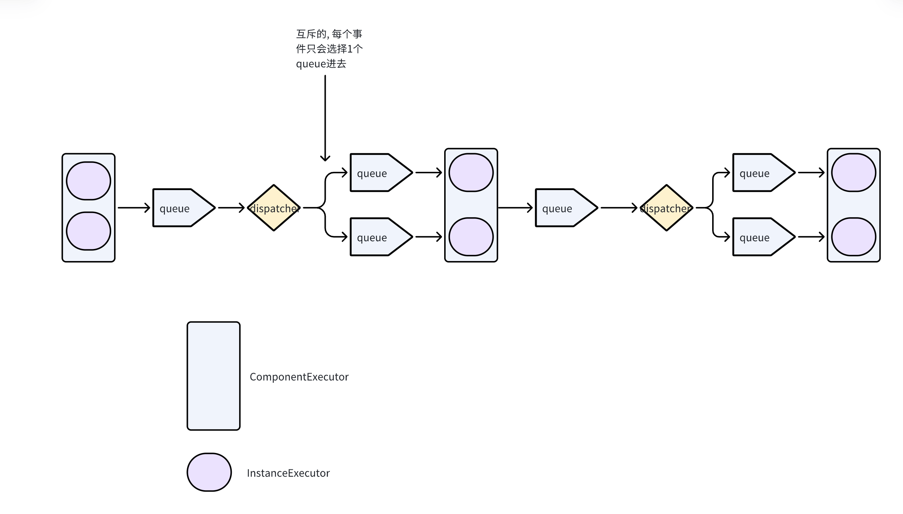

# Streamwork
The source code for this book: [Grokking Streaming Systems: Real-time Event Processing](https://www.manning.com/books/grokking-streaming-systems).

This is a simple local stream processing engine with some example jobs. The objective is to demonstrate how streaming systems work internally. It works for Windows, MacOS and Linux.

To download the code, run this command in your terminal:
```
git clone https://github.com/nwangtw/GrokkingStreamingSystems.git
```

### Tools required
- Git: it is used to fetch the source code.
- JDK 11: the source code is in Java 11.
- Apache maven: the build tool used by the projects.
- netcat (Mac and Linux) or nmap (Windows, Mac and Linux): the tool used as the event reader.

### Build the project
```
$ mvn clean package
```
After a successful build of the project you should be able to run all of the examples in the jar from the command line.

### Run the example jobs
Example jobs are developed on Mac but they should work for Linux and Windows too (some commands are slightly different on Windows). The jobs read input events from one or two terminals. So the basic steps of running an example job are:
1. Start the readers in two input terminals (some examples read input from only one reader but it doesn't hurt to have the second one running). If you are using `nmap` instead of `netcat`, the command is `ncat` instead of `nc` and the arguments are the same.
```bash
nc -lk 9990
```
and
```bash
nc -lk 9991
```
2. Start the job in the output (the third) terminal. Replace `/` with `\` on windows.
```bash
# Chapter 2. A basic vehicle count job.
java --add-opens java.base/java.lang=ALL-UNNAMED -cp target/gss.jar com.streamwork.ch02.job.VehicleCountJob
# Chapter 3. A vehicle count job with two source instances and one operator instance.
java --add-opens java.base/java.lang=ALL-UNNAMED -cp ./target/gss.jar com.streamwork.ch03.job.ParallelizedVehicleCountJob1
# Chapter 3. A vehicle count job with two source instances and two operator instances, shuffle grouping.
java -cp ./target/gss.jar com.streamwork.ch03.job.ParallelizedVehicleCountJob2
# Chapter 3. A vehicle count job with two source instances and two operator instances, fields grouping.
java -cp ./target/gss.jar com.streamwork.ch03.job.ParallelizedVehicleCountJob3
# Chapter 4. A fraud detection job
java -cp ./target/gss.jar com.streamwork.ch04.job.FraudDetectionJob
# Chapter 4. A job with a forked stream.
java -cp ./target/gss.jar com.streamwork.ch04.extra.StreamForkJob
# Chapter 4. A job with a merged stream.
java -cp ./target/gss.jar com.streamwork.ch04.extra.StreamMergeJob
# Chapter 4. A job with a split stream.
java -cp ./target/gss.jar com.streamwork.ch04.extra.StreamSplitJob
# Chapter 5. A system usage job.
java -cp ./target/gss.jar com.streamwork.ch05.job.SystemUsageJob
# Chapter 7. A test job with windowing support.
java -cp ./target/gss.jar com.streamwork.ch07.job.WindowingTestJob
# Chapter 8. A emission monitor job with a join operator.
java -cp ./target/gss.jar com.streamwork.ch08.job.EmissionJob
```
3. Input events in the readers and examine the output in the output terminal.
4. Have fun~

One more thing, after a job is started, you can view the structure of your job by opening a browser and visiting http://localhost:7000.


# 源码阅读笔记

1. 本地启动时, java 要加一个jvm参数, 因为java16+以后反射的可见性变得更严格了, `java --add-opens java.base/java.lang=ALL-UNNAMED -cp xxx`
2. ch02中的同一个stream不支持apply多个不同的operator, 即使设置了, 也只有后设置的x2能收到event
```java
stream.applyOperator(x1);
stream.applyOperator(x2);
```
这是因为在`connectExecutors`方法中, `connection.from`必然会设置成新的队列, 因此如果有多个operator, 只有最后一个会和上游共享同一个队列:
```agsl
private void connectExecutors(Connection connection) {
    // It is a newly connected operator executor. Note that in this version, there is no
    // shared "from" component and "to" component. The job looks like a single linked list.
    EventQueue intermediateQueue = new EventQueue(QUEUE_SIZE);
    connection.from.setOutgoingQueue(intermediateQueue);
    connection.to.setIncomingQueue(intermediateQueue);
 }
```
3. ch03中的每个组件是如下图连接起来的



4. 目前为止流仍然只支持单向链表, 不支持DAG, 如下图所示

